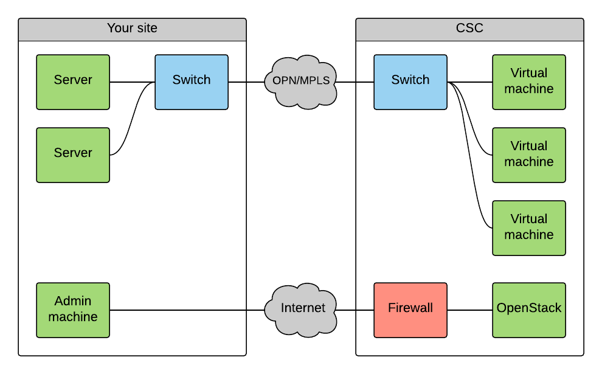
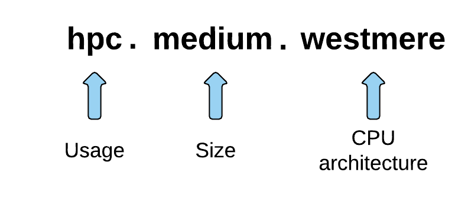

ePouta pilot user guide
=======================

.. note::

   ePouta is currently only available for selected pilot users. If you are not a
   selected pilot user, then this documentation is most likely not very useful
   for you.

This guide gives some basic information about using ePouta. As a service it is
quite similar to cPouta, so if you are familiar with that service you should be
able to start using ePouta quite easily. There are some differences which are
listed under the heading ":ref:`differences-compared-to-cpouta`".

Pilot use disclaimer
--------------------

Any virtual machines or other resources that are launched during the pilot phase
may be removed either at some stage during the pilot phase if changes are made
or when the service moves into production. We will give you notice about any
destructive or potentially destructive changes beforehand. As with any IaaS
cloud service, it is a good practice to build your resources in a way that is
easy to replicate in a situation where existing resources get destroyed. We
recommend using configuration management tools when deploying virtual machines
in the cloud.

Initial setup for customers
---------------------------

Some initial steps are required before you can start using ePouta: connecting
your organization's network to ePouta and getting user accounts for those users
that need to manage (start/stop/destroy etc.) virtual machines.

Setting up networking between your site and ePouta
..................................................

Unlike in cPouta and other typical IaaS clouds, in ePouta the virtual machines
don't have access to the public Internet. Instead, virtual machines of an
individual customer are only connected to that customer's own network through
either an OPN (Optical Private Network) or - within FUNET and European academic
networks - an MPLS (Multiprotocol Label Switching)
connection. This means that in order to access your virtual machines, you will
go through your own organization's network instead of going over the public
Internet. This also means that running public web services on ePouta is not
possible. To get started with connecting your network to ePouta, please send a
request to `cloud-support@csc.fi <mailto:cloud-support@csc.fi>`_.

The above image shows the connections to virtual machines and to the management
interface in ePouta ("OpenStack"). As can be seen in the image, the network of
the virtual machines running in ePouta is completely separate from the public
Internet.

To create the connection between your site and ePouta, some initial information
is required:

#. A range of IP addresses from which addresses will be allocated to virtual
   machines running in ePouta
#. The IP address of the gateway in the subnet in which the IP range is
#. The IP addresses of DNS servers that should be used by virtual machines and
   that are accessible from the subnet
#. A set of IP addresses or ranges ("Admin machine" in the image above) that
   will be allowed to access the management interfaces of ePouta ("OpenStack" in
   the image above)

During the process of setting up the connection between your site and ePouta, we
will send you email asking you to provide this information. If you later wish to
e.g. add more IP addresses to be whitelisted for access to the ePouta
interfaces, please send email to `cloud-support <mailto:cloud-support@csc.fi>`_.

Getting access to OpenStack
...........................

The process of getting access to use the ePouta web interface and APIs is partly
the same one you would use for cPouta. You will need a computing project and
user accounts added to that computing project. If you don't already have a
computing project, you need to apply for one here:

`User Accounts and Projects
<https://research.csc.fi/accounts-and-projects>`_

Logging in
..........

The address for the ePouta web interface is https://epouta.csc.fi. You can
mostly follow the `cPouta User Guide
<https://research.csc.fi/pouta-user-guide>`_ for instructions on how to use
OpenStack.

Usage
-----

Flavors
.......

===================== ========= ============ ================== ======================= ========
**Name**              **VCPUs** **RAM (MB)** **Root disk (GB)** **Ephemeral disk (GB)** **BU/h**
--------------------- --------- ------------ ------------------ ----------------------- --------
hpc.mini              2         3600         80 (Ceph)          0                       5
hpc.small             4         7200         80 (Ceph)          0                       10
hpc.medium.westmere   8         14400        80 (Ceph)          0                       8
hpc.large.westmere    16        28800        80 (Ceph)          0                       16
hpc.xlarge.westmere   23        42000        80 (Ceph)          0                       24
hpc.largemem.westmere 23        92000        80 (Ceph)          0                       36
hpc.medium.haswell    8         40000        80 (Ceph)          0                       20
hpc.large.haswell     16        80000        80 (Ceph)          0                       40
hpc.xlarge.haswell    32        160000       80 (Ceph)          0                       80
hpc.fullnode.haswell  46        248000       80 (Ceph)          0                       120
io.haswell.8core      8         40000        20 (SSD/RAID0)     350 (SSD/RAID0)         25
io.haswell.16core     16        80000        20 (SSD/RAID0)     700 (SSD/RAID0)         50
io.haswell.32core     32        160000       20 (SSD/RAID0)     1400 (SSD/RAID0)        100
io.haswell.46core     46        248000       20 (SSD/RAID0)     2100 (SSD/RAID0)        150
tb.westmere.32core    32        500000       80 (SAS/RAID6)     3250 (SAS/RAID6)        320
tb.westmere.64core    64        1000000      80 (SAS/RAID6)     6500 (SAS/RAID6)        640
===================== ========= ============ ================== ======================= ========

The table above shows the different flavors that are available in ePouta
initially. If you've used cPouta, you will notice that the flavors in ePouta are
slightly different. This is because different hardware is used in these two
clouds. The largest flavor in cPouta would not fit on the servers that were
added initially to ePouta. More hardware is on its way though, so you can expect
these flavors to change in the future.

A specific naming convention is used for the flavors. The first part is the
intended use for that flavor. Initially this is "hpc" (high performance
computing) for all flavors as these flavors are intended mainly for heavy
computation. Later on we may introduce other flavor types. The second part is an
understandable size for the flavor that tells you how large the flavor is.
Finally, some of the flavors have a third part which tells you the processor
architecture (e.g. "westmere", "haswell") of the virtual machine that you will be running
if you select that flavor. The flavors whose name has this third part are
guaranteed to be scheduled on hardware that uses this specific CPU architecture.
Flavors without this third part can be scheduled on any server that is
available.

Initially all the servers in ePouta had processors based on Intel's
`Westmere <https://en.wikipedia.org/wiki/Westmere_%28microarchitecture%29>`_
microarchitecture. Servers with processors based on Intel's
`Haswell
<https://en.wikipedia.org/wiki/Haswell_%28microarchitecture%29>`_ architecture
were added in Q1/2016.

Using ePouta from the command line
..................................

.. note::

   You can only use the common "openstack" tool with ePouta. The other tools
   (nova, cinder, glance, neutron) do not work as they do not have support for
   domains.

You can find instructions on command line usage from the `cPouta user guide
<https://research.csc.fi/pouta-command-line-tools>`_. The commands listed on that
page should also work against ePouta with the exception of the commands for
using floating IP addresses, since you cannot attach floating IP addresses to
instances in ePouta. The process for using the tools is exactly the same: you go
to the web interface to get an openrc file, you source that file and then you
can start using commands like "openstack server list" or "openstack server
create".

.. _differences-compared-to-cpouta:

Differences compared to cPouta
------------------------------

* No floating IPs are available to be attached to virtual machines nor will they
  be in the future.
* The web interface and the APIs are only accessible from whitelisted IP ranges.
* If you wish to use command line tools, the only command line tool that will
  work at the moment is the common "openstack" tool

Getting support
---------------

Questions and reports about issues can be sent to `cloud-support@csc.fi
<mailto:cloud-support@csc.fi>`_.
